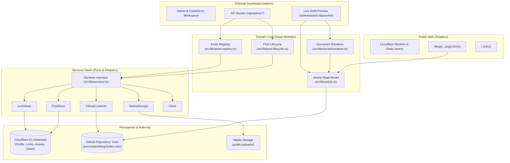
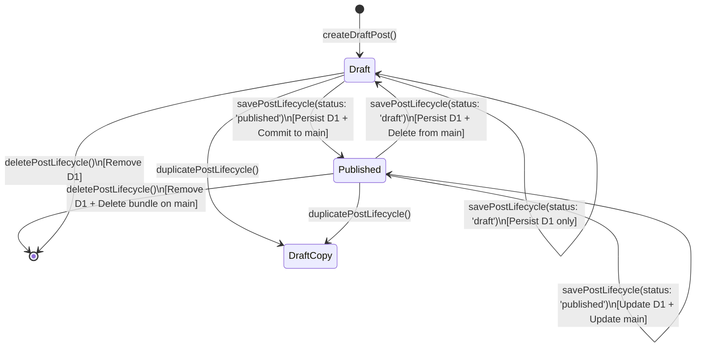
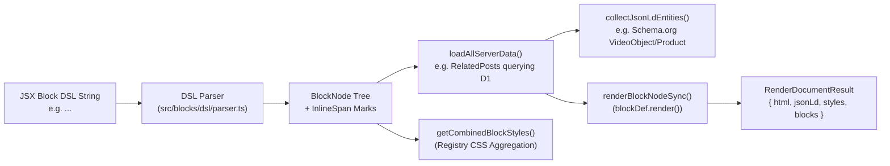
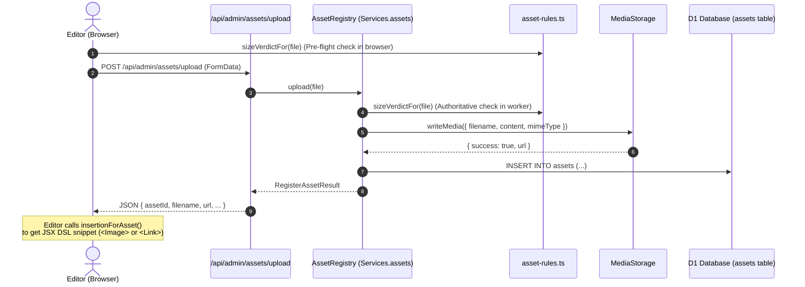

# Codebase Architecture

This document details the architectural principles, domain model, system boundaries, and core modules of the **blog-astro** publishing platform.

---

## 1. System Overview & Architectural Tenets

The system is a modern, high-performance publishing platform built on **Astro** and **Cloudflare Workers**. It unites a statically deployed public publication with a live, edge-rendered editorial administration dashboard, powered by Cloudflare D1 (SQLite at the edge) and the GitHub Contents REST API.



### Key Tenets

1. **Dual Authority Model ([ADR-0011](file:///e:/repos/astro/blog/docs/adr/0011-published-article-authority.md))**:
   - **`main` is authoritative for published Article content and metadata**. The Git bundle (`src/content/blog/<slug>/index.mdx`) is the ultimate source of truth for readers.
   - **Cloudflare D1 is authoritative for Draft content and editorial state** (including pessimistic Concurrency Locks, editor accounts, and session tokens).
   - Published rows in D1 `posts` table are a fast projection of `main`. Divergence between `main` and D1 is treated as a defect state to be detected, not an alternative source of truth.
2. **Deterministic Parity via Unified Document Renderer ([ADR-0010](file:///e:/repos/astro/blog/docs/adr/0010-structured-jsx-block-dsl-and-pluggable-registry.md))**:
   - Content is authored and stored in a structured **JSX Block DSL** rather than Markdown.
   - Regex parsing has been eliminated. The parser and renderer (`src/blocks/dsl/`) produce identical HTML markup, CSS stylesheets, and Schema.org JSON-LD graphs across both **Live Draft Preview** and **Production Builds**.
3. **Deep Modules & Clean Seams**:
   - Complex workflows (draft creation, duplication, saving, validation, git synchronization, media asset registration, and locking) are encapsulated inside deep modules with narrow, minimal interfaces.
   - External dependencies (database, Git API, storage, clock) sit behind pluggable adapters defined on the `Services` seam (`src/lib/services.ts`), allowing the entire domain to be tested in-memory with sub-2-second test execution.
4. **Explicit Authorial Intent ([ADR-0009](file:///e:/repos/astro/blog/docs/adr/0009-explicit-editorial-publishing-and-d1-drafts.md))**:
   - Zero background network autosave: local changes update dirty state (`isDirty = true`) protected by `beforeunload`.
   - Explicit publishing directly to `main` via atomic commits, bypassing fragile multi-step pull request branch dances.

---

## 2. Domain Model & Ubiquitous Language

Per [CONTEXT.md](file:///e:/repos/astro/blog/CONTEXT.md), domain language is strict and intentional:

| Domain Term | Definition & Role | Terms to Avoid |
| :--- | :--- | :--- |
| **Post / Article** | A publication document containing validated metadata and structured block content in JSX DSL. *"Post"* aligns with database/admin models (`posts` table, `/admin/posts`); *"Article"* aligns with editorial domain and prose presentation. | Entry, piece |
| **Block Node** | A typed, schema-validated structural unit in an article (e.g. `Paragraph`, `Heading`, `Callout`, `YouTube`, `AmazonProduct`, `List`, `Quote`, `CodeBlock`), with a unique ID, typed props, and child blocks/inline spans. | Markdown element, raw widget |
| **Mark & Mark Ref** | Inline semantic formatting. Simple styles (`Bold`, `Italic`, `Strike`, `Code`, `Underline`) are Marks; entity-referencing formatting (`Link` with `href`, `target`, `rel`, `download`) are Mark Refs. | Markdown symbols, inline tag hacks |
| **JSX Block DSL** | The human-friendly, unambiguous JSX-based authoring and storage syntax (`<Heading level={2}>`, `<Callout variant="warning">`) replacing Markdown across the entire publishing pipeline. | Markdown text, MDX body |
| **Block Registry** | The central typed registry (`src/blocks/registry.ts`) compiling schemas, self-contained CSS styles, server-side data fetchers, and JSON-LD generators for pluggable blocks. | Component list, widget index |
| **Document Renderer** | The unified rendering engine (`renderDocument`) that deterministically parses JSX Block DSL and produces identical HTML, CSS, and JSON-LD. | Markdown parser, regex renderer |
| **Post Bundle** | A folder containing a post's `index.mdx` alongside its co-located media assets within `src/content/blog/<slug>/`. | Post directory, raw folder |
| **Post Lifecycle** | The domain module coordinating all article state transitions: draft creation, post duplication, validation, Concurrency Lock verification, Post Bundle serialization, Git publishing, and D1 persistence. | Post service, article manager |
| **Services** | The edge-resolved adapter bag providing access to database, storage, Git contents, locks, and system clock through clean interfaces. | Global container, DI framework |
| **Concurrency Lock** | A pessimistic lock record in D1 (`post_locks`) granting exclusive edit rights to an active editor, maintained via heartbeats and beacon release. | Mutex, file lock |

---

## 3. Core Architecture & Component Boundaries

### 3.1. Services Seam & Ports & Adapters

All infrastructure interactions are concentrated at the edge in `src/lib/services.ts`. Callers accept `Services` rather than instantiating database clients or storage drivers directly:

```typescript
export interface Services {
  db: DbClient;
  posts: PostStore;
  locks: LockStore;
  mirror: ArticleMirror;
  contents: GithubContents | null;
  media: MediaStorage;
  assets: AssetRegistry;
  clock: Clock;
}
```

- **`PostStore` (`src/lib/post-store.ts`)**: Editorial record persistence seam. Implemented by `createD1PostStore` in production and `InMemoryPostStore` for tests.
- **`LockStore` (`src/lib/locks.ts`)**: Pessimistic locking seam with time-to-live verification. Implemented by `createD1LockStore` and `InMemoryLockStore`.
- **`GithubContents` (`src/lib/github-contents.ts`)**: The sole gateway to GitHub's REST API (`PUT /contents`, `DELETE /contents`, `deleteBranch`). Uses `HttpGithubContents` or `InMemoryGithubContents`.
- **`MediaStorage` (`src/lib/media-storage.ts`)**: Stores asset bytes (commit to `public/uploads/` via GitHub in production, or write to local disk during local development).
- **`AssetRegistry` (`src/lib/asset-registry.ts`)**: Unified seam synchronizing D1 asset records and `MediaStorage` bytes.
- **`Clock` (`src/lib/clock.ts`)**: Abstraction over time (`systemClock` vs. `FixedClock`), ensuring zero non-deterministic timestamps in tests.

### 3.2. Post Lifecycle Module

The `PostLifecycle` module (`src/lib/post-lifecycle.ts`) is a **deep module** encapsulating all post lifecycle operations behind simple, testable functions:



#### Invariants Enforced by `PostLifecycle`:
1. **Concurrency Lock Check**: Verifies that the acting user holds the active pessimistic lock (returns HTTP 423 if held by another editor).
2. **Slug Invariants**: Validates slug format (`^[a-z0-9]+(?:-[a-z0-9]+)*$`) and checks uniqueness across all posts.
3. **Renderability Verification**: Passes content through `inspectDocument`. If content contains unrenderable syntax or suspect tags for a published post, the operation is refused with HTTP 422 before touching D1 or GitHub.
4. **Guaranteed Local Persistence**: The D1 database record is always saved first.
5. **Git Synchronization**:
   - When publishing: writes Post Bundle (`src/content/blog/<slug>/index.mdx`) directly to `main` via `contents.putFile`.
   - When unpublishing: removes the Post Bundle from `main` via `contents.deleteFile`.
   - In local development, mirrors changes to the filesystem (`src/content/blog/`) via `ArticleMirror`.

### 3.3. JSX Block DSL & Unified Document Renderer

The blog avoids Markdown parsing and Sätteri AST hacks in favor of a clean, typed block structure:



#### Block Registration (`src/blocks/registry.ts`)
Each block definition under `src/blocks/<name>/` implements `BlockDefinition<TProps, TData>`:
- **`schema`**: Valibot schema for props validation.
- **`render(props, childrenHtml, data, ctx)`**: Pure HTML renderer.
- **`styles`**: Self-contained CSS string aggregated into the final response.
- **`loadServerData(props, ctx)`**: Optional asynchronous data fetching (e.g. `related-posts` querying other articles).
- **`generateJsonLd(props, data)`**: Schema.org entity synthesis (e.g. `YouTube` block generating `VideoObject`, `AmazonProduct` generating `Product`).
- **`drawer`**: Self-describing presentation metadata for the editor's Blocks drawer.

### 3.4. Asset Management Seam

Asset management coordinates media uploads, byte persistence, metadata tracking, and editor insertion:



- **`asset-rules.ts`**: Pure, zero-dependency validation engine shared by client and server (2 MB limit for images, 25 MB for documents/other media).
- **`insertion.ts`**: The single owner of the DSL syntax for inserted assets (`<Image src="..." />` for images, `<Link href="..." download="...">` for documents).

### 3.5. Article Read Model

The `ArticleReadModel` (`src/lib/article.ts`) provides a unified query layer that abstracts the physical storage of articles:
- **`loadVisible(slug)`**: Loads a published article for public view, or a draft if drafts are explicitly enabled.
- **`listVisible()`**: Lists visible articles ordered chronologically.
- **`listRelated(options)`**: Returns related published articles by category, excluding the current article.

Behind the read model sit two distinct adapters:
1. **`createGitBundleSource()` (`src/lib/article-sources/git-bundle.ts`)**: Reads from Astro's static content collection (`src/content/blog/`). Used during production static builds (`/blog/[...slug].astro`).
2. **`createD1Source(db)` (`src/lib/article-sources/d1.ts`)**: Reads directly from D1 `posts`. Used during Live Draft Preview and in administrative queries.

---

## 4. Administrative Client Architecture

The admin editor (`/admin/posts/[id].astro`) provides an interactive editorial experience using CodeMirror 6 with modular client-side components:

```
src/scripts/editor/
├── index.ts               # Entry point; wires adapters and session lifecycle
├── editor-session.ts      # Pure session state management (dirty tracking, status)
├── actions.ts             # Orchestrates save, duplicate, delete, unpublish HTTP calls
├── dom-adapter.ts         # Directs browser DOM, action bar, drawer tabs, and toolbar
├── asset-modal.ts         # Focused asset picker modal with gallery & upload dropzone
└── lock-manager.ts        # Concurrency lock heartbeat loop and Beacon API release
```

1. **`EditorSession` (`editor-session.ts`)**: Pure state machine managing content dirty flags, status state (`draft` vs `published`), and unload protection warnings.
2. **`EditorActions` (`actions.ts`)**: Translates user actions into typed API requests to `/api/admin/posts/*` and `/api/admin/assets/*`.
3. **`AssetPickerModal` (`asset-modal.ts`)**: Standalone modal dialog presenting an asset browser with search, category filtering, drag-and-drop file upload, and a clean selection callback.
4. **`LockManager` (`lock-manager.ts`)**: Periodically pings `/api/admin/posts/lock` every 30 seconds to maintain the pessimistic lock, releasing it via `navigator.sendBeacon` upon window unload.

---

## 5. Security & Authentication

1. **Password Hashing (`src/lib/auth.ts`)**:
   - Secure PBKDF2 key derivation (`PBKDF2-HMAC-SHA256`) with 100,000 iterations and cryptographically random 16-byte salts.
2. **Session Model (`src/lib/session.ts`)**:
   - Secure, random 32-byte hexadecimal session tokens stored in the `sessions` table.
   - HttpOnly, Secure, SameSite cookies with 7-day expiration.
3. **Edge Middleware Guard (`src/middleware.ts`)**:
   - Intercepts all requests matching `/admin` and `/api/admin`.
   - Resolves the active user and session from D1, attaching them to `Astro.locals`.
   - Redirects unauthenticated requests to `/admin/login` or returns 401 JSON for API endpoints.

---

## 6. Directory Layout

```
.
├── CONTEXT.md                    # Canonical domain glossary and definitions
├── astro.config.mjs              # Astro configuration (Cloudflare adapter + MDX loader)
├── wrangler.jsonc                # Cloudflare Workers & D1 database bindings
├── drizzle.config.ts             # Drizzle ORM schema configuration
├── migrations/                   # D1 database SQL migrations
├── docs/
│   ├── adr/                      # Architectural Decision Records (0001 - 0011)
│   ├── agents/                   # Agent operational guides (domain, triage, issues)
│   └── architecture.md           # This document
└── src/
    ├── blocks/                   # Pluggable Block Registry & JSX Block DSL
    │   ├── dsl/                  # Parser, serializer, inspector, and renderer
    │   ├── registry.ts           # Central Block Registry
    │   └── [block-name]/         # Individual self-contained blocks
    ├── db/
    │   └── schema.ts             # Drizzle D1 database schema (users, posts, assets, locks)
    ├── layouts/                  # Astro page layouts (RootLayout)
    ├── lib/                      # Core domain modules, seams, and adapters
    │   ├── admin-route.ts        # Admin API route wrapper with error handling
    │   ├── article.ts            # Article Read Model
    │   ├── article-sources/      # Read model adapters (Git bundle & D1)
    │   ├── article-write-model.ts# Payload parser & validator
    │   ├── asset-registry.ts     # Asset Registry seam & D1/MediaStorage coordination
    │   ├── asset-rules.ts        # Dependency-free asset validation rules
    │   ├── auth.ts               # PBKDF2 password hashing & verification
    │   ├── github-contents.ts    # GitHub REST API adapter
    │   ├── locks.ts              # Pessimistic concurrency locks
    │   ├── media-storage.ts      # Byte persistence adapter (GitHub/disk)
    │   ├── post-lifecycle.ts     # Deep module managing all post state transitions
    │   ├── post-store.ts         # PostStore persistence seam (D1 / InMemory)
    │   ├── services.ts           # Services seam resolving adapters at the edge
    │   └── session.ts            # Session token management
    ├── pages/
    │   ├── admin/                # Edge-rendered editorial dashboard routes
    │   │   ├── posts/[id].astro  # Full-screen CodeMirror article editor
    │   │   ├── posts/[id]/preview.astro # Live Draft Preview
    │   │   ├── assets/index.astro# Asset library manager
    │   │   ├── profile.astro     # User profile and security
    │   │   └── login.astro       # Editorial authentication
    │   ├── api/admin/            # JSON API endpoints for editorial actions
    │   ├── blog/                 # Statically rendered public blog routes
    │   │   └── [...slug].astro   # Article page with SSG getStaticPaths
    │   └── index.astro           # Homepage
    ├── scripts/editor/           # Browser-side CodeMirror and UI controllers
    └── templates/                # Post presentation templates (default, two-column)
```

---

## 7. Testing Strategy

The architecture follows a strict **"accept dependencies, don't create them"** discipline, enabling high-coverage unit testing across all domain invariants without requiring live network connections, external databases, or Cloudflare Workers emulators.

- **Vitest Suite**: 180+ tests run in under 2 seconds.
- **In-Memory Substitutes**:
  - `InMemoryPostStore` replaces D1 SQLite.
  - `InMemoryLockStore` replaces D1 pessimistic locks.
  - `InMemoryAssetRegistry` replaces database and media storage.
  - `InMemoryGithubContents` simulates the GitHub REST API and git branches.
  - `FixedClock` guarantees deterministic timestamps.
- **Test Coverage**:
  - `post-lifecycle.test.ts`: Validates all transitions (drafting, publishing, unpublishing, deleting, duplicating, locking, and validation errors).
  - `article.test.ts`: Verifies the `ArticleReadModel`, visibility filtering, and related posts logic.
  - `inspect.test.ts`: Ensures invalid or unrenderable JSX Block DSL tags are refused prior to publishing.
  - `asset-registry.test.ts`: Validates file size rules, metadata updates, and upload workflows.
  - `actions.test.ts` & `editor-session.test.ts`: Tests client-side dirty state transitions, action buttons, and keyboard shortcuts.
