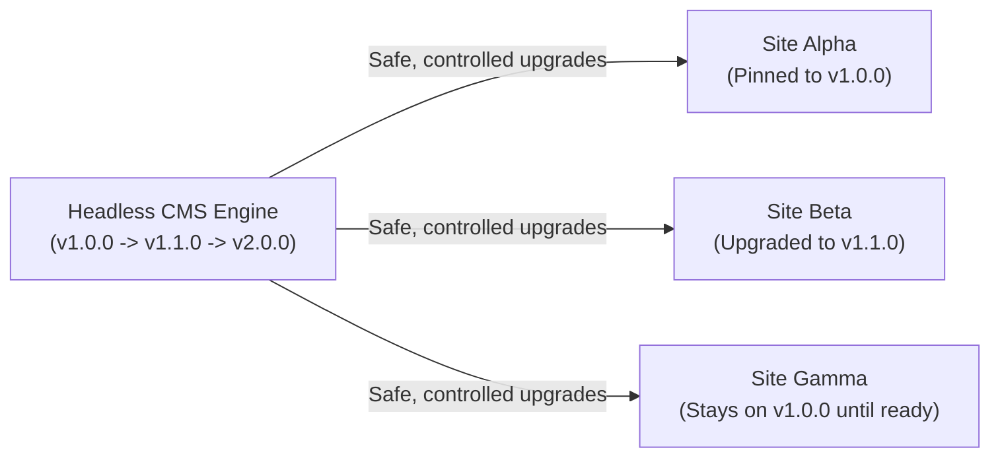
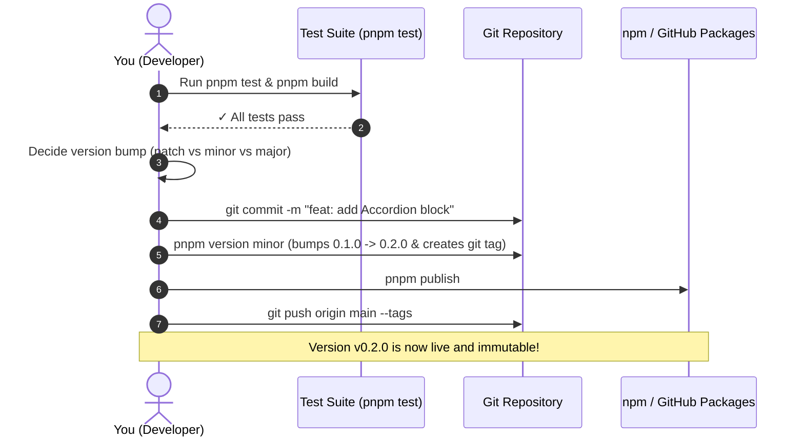

# A Beginner's Complete Guide to Versioning & Package Workflows

If you have never built or maintained a versioned software package before, this guide is designed for you. It explains the core concepts, the daily development loop, how to release updates safely, and how consumer sites upgrade without breaking.

---

## 1. The Big Mental Shift: Monorepo vs. Versioned Engine

### The Monorepo Model (Where you started)
In a single repository, everything lives on `main`. When you edit a component, you change the consumer site in the same Git commit. 
- *Problem*: If you have 5 different websites sharing the same CMS, every small CMS tweak forces all 5 sites to rebuild, risks breaking site-specific layouts, and entangles their Git histories.

### The Versioned Engine Model (Where you are now)
The CMS engine (`@org/cms` and `@org/blocks`) is an independent product — just like `astro`, `react`, or `tailwindcss`.
- Each website is an independent repository with its own Git history, deployment pipeline, and content.
- Each website declares which version of the CMS it is currently using in its `package.json`.
- **A version number is a contract of stability**. Site Alpha can happily stay on version `1.2.0` while Site Beta tests version `1.3.0`. When you update the CMS, Site Alpha does not change until its owner deliberately runs `pnpm update`.



---

## 2. Semantic Versioning (SemVer) Demystified

Every version string consists of three numbers separated by dots: **`MAJOR.MINOR.PATCH`** (for example: `1.4.2`).

```
    1    .    4    .    2
    ▲         ▲         ▲
  MAJOR     MINOR     PATCH
```

| Component | When to increment | Guarantee to consumer sites | Concrete CMS Example |
| :--- | :--- | :--- | :--- |
| **PATCH**<br>`1.4.2` → `1.4.3` | **Bug fixes & internal refactors** | **100% Backward-compatible**.<br>Zero breaking changes. Safe to update anytime without editing site code. | • Fixed a CSS padding glitch in `<Callout>`.<br>• Fixed an edge case in date parsing.<br>• Optimized image WebP conversion speed. |
| **MINOR**<br>`1.4.2` → `1.5.0` | **New features & additive enhancements** | **100% Backward-compatible**.<br>New capabilities are added, but all existing code, blocks, and content continue to work untouched. | • Added a new core block (e.g. `<Accordion>`).<br>• Added an optional parameter to `defineConfig()`.<br>• Added a new button to the editor toolbar. |
| **MAJOR**<br>`1.4.2` → `2.0.0` | **Breaking changes** | **May require manual code migration**.<br>Existing functions or schemas were altered or removed. | • Renamed a required property in `BlockDefinition`.<br>• Removed a deprecated API or dropped older Node versions.<br>• Altered database table column types destructively. |

> [!NOTE] What about versions starting with `0.x.x` (e.g. `0.1.0`)?  
> In SemVer, `0.x.x` indicates initial development. During `0.x.x`, the public API is considered unstable, and minor increments (`0.1.0` → `0.2.0`) may introduce breaking changes. Once you are happy with the architecture and public seams, you publish `1.0.0` to lock in strict SemVer guarantees.

---

## 3. Understanding `package.json` Symbols and Lockfiles

In your site's `package.json`, you will see symbols in front of version numbers:

### Caret (`^`) — Allow compatible updates (Default)
```json
"dependencies": {
  "@org/cms": "^1.2.0"
}
```
- Means: *"Give me the latest version that does not change the left-most non-zero digit."*
- For `^1.2.0`: accepts `1.2.1`, `1.3.0`, `1.9.9`, but **never** `2.0.0`.
- Safe because MINOR and PATCH are guaranteed not to break your site.

### Tilde (`~`) — Allow bugfix patches only
```json
"dependencies": {
  "@org/cms": "~1.2.0"
}
```
- Means: *"Give me bug fixes only."*
- For `~1.2.0`: accepts `1.2.1`, `1.2.9`, but **never** `1.3.0`.

### Exact Version — Strict pin
```json
"dependencies": {
  "@org/cms": "1.2.0"
}
```
- Means: *"Install only version 1.2.0, nothing else."*

### Why does `pnpm-lock.yaml` matter?
Even if you use `^1.2.0`, running `pnpm install` in CI will **not** randomly download a newer version. 
- The lockfile (`pnpm-lock.yaml`) records the exact commit/tarball checksum downloaded on your machine.
- As long as you commit `pnpm-lock.yaml` to Git, your site builds with 100% mathematical determinism across all machines.
- Your site only upgrades when you explicitly run `pnpm update`.

---

## 4. The Daily Developer Workflows

### Workflow 1: How to test CMS changes locally BEFORE releasing
**The Dilemma**: You want to add a feature to the CMS, but how do you test it inside `site-a` without publishing an untested package to the world?

You have two primary techniques:

#### Technique A: Local Workspace Monorepo (Recommended for initial development)
While developing features, keeping `packages/cms` and `sites/site-a` in the same pnpm workspace allows `site-a` to use `"cms": "workspace:*"`. Any edit to the CMS is instantly visible in `site-a` with hot module reloading. Once the feature is verified and tests pass, you bump the package version and release.

#### Technique B: `pnpm link` (For separate local repositories)
If the CMS and Site are already in separate Git checkouts on your computer:
```bash
# 1. In your local CMS repository:
cd ~/repos/headless-cms/packages/cms
pnpm link --global

# 2. In your local Site repository:
cd ~/repos/site-a
pnpm link --global cms
```
Now `site-a` uses your local live CMS code instead of the downloaded package! When you are done testing:
```bash
pnpm unlink --global cms
pnpm install --force
```

#### Technique C: Local Tarball (`pnpm pack`)
Build the exact `.tgz` file that npm would distribute:
```bash
# In headless-cms/packages/cms:
pnpm pack
# Emits cms-0.1.0.tgz

# In site-a:
pnpm add ../headless-cms/packages/cms/cms-0.1.0.tgz
```

---

### Workflow 2: Releasing a New CMS Version (Step-by-Step)

When you have made improvements to the CMS and verified they pass all tests:



#### Step 1: Run the test suite
Never bump versions without running tests:
```bash
pnpm test
```

#### Step 2: Bump the version
You don't need to manually edit `package.json`. Use the CLI:
```bash
# If you fixed bugs:
pnpm version patch   # 0.1.0 -> 0.1.1

# If you added backward-compatible features:
pnpm version minor   # 0.1.0 -> 0.2.0

# If you made breaking changes:
pnpm version major   # 0.1.0 -> 1.0.0
```
This command automatically updates `package.json`, commits the change, and creates a Git tag (e.g. `v0.2.0`).

#### Step 3: Publish
```bash
pnpm publish
git push origin main --tags
```

---

### Workflow 3: Upgrading a Consumer Site to the New Version

Now switch to your site's repository (`site-a`):

#### Step 1: Check for outdated packages
```bash
pnpm outdated
```
Shows you what version you have installed vs. what newer versions are available.

#### Step 2: Update the package
```bash
# Update cms to the latest compatible version
pnpm update cms

# Or target a specific version:
pnpm add cms@^0.2.0
```

#### Step 3: Apply Database Migrations (if applicable)
If the new CMS release included new D1 database tables or columns:
```bash
pnpm d1:migrate --local   # Test locally first
```

#### Step 4: Verify the build
```bash
pnpm dev      # Open browser and test
pnpm build    # Ensure static SSG builds cleanly
```

#### Step 5: Commit and Deploy
```bash
git add package.json pnpm-lock.yaml
git commit -m "chore: upgrade cms to v0.2.0"
git push origin main
```
Your site's GitHub Actions CI/CD automatically detects the push, applies migrations, builds static HTML, and deploys to Cloudflare Workers!

---

## 5. Golden Rules for Versioned Database Migrations

When you maintain a standalone website, you can run destructive SQL (`ALTER TABLE DROP COLUMN`) anytime.  
**In a decoupled CMS, you must follow additive migration discipline**:

1. **Rule 1: All D1 migrations must be additive**:
   - New columns must have default values (`DEFAULT 'default'`) or be nullable.
   - *Why*: Site Alpha might upgrade to CMS `v1.2` today, but Site Beta might wait two months. If migration `0009` drops an active column, Site Beta will crash!
2. **Rule 2: Never rename or delete active columns in one step**:
   - Step 1 (Release `v1.1`): Add the new column. Write to both old and new columns. Deprecate the old one.
   - Step 2 (Release `v2.0` months later): Once all sites have upgraded, safely drop the old column.
3. **Rule 3: Migrations ship inside the package**:
   - As configured in ADR-0017, the CMS package exports `./migrations`.
   - The site's `wrangler.jsonc` points to `"migrations_dir": "node_modules/cms/migrations"`, ensuring migrations travel automatically with package upgrades.

---

## 6. Automating Releases with Changesets (Industry Standard)

As your project grows, manual version bumping can feel tedious. Leading open-source projects (Astro, Vite, Tailwind, Svelte) use a tool called **[Changesets](https://github.com/changesets/changesets)**.

### How Changesets Works:
1. Whenever you make a change in a PR, you type:
   ```bash
   npx changeset
   ```
2. An interactive prompt asks:
   - *Which package changed?* (`cms`)
   - *Is this a patch, minor, or major change?* (`minor`)
   - *Enter a summary of the change*: ("Added new interactive LivePoll block")
3. Changeset writes a small markdown file in `.changeset/`. You commit it with your PR.
4. When merged to `main`, an automated GitHub Action reads all changeset markdown files, bumps the versions, generates a `CHANGELOG.md`, and publishes to npm automatically. Zero manual versioning steps!

---

## 7. Beginner FAQ & Common Pitfalls

### Q: "I published version `0.1.1` but found a bug 5 minutes later. Can I re-publish or overwrite `0.1.1`?"
**NO**. Package registries (npm and GitHub Packages) enforce strict immutability. Once a version number is published, it can **never** be replaced or overwritten.  
*Fix*: Simply fix the bug, run `pnpm version patch`, and publish `0.1.2`. In software development, version numbers are free!

### Q: "I ran `pnpm update cms` in my site, but it didn't download the new version. Why?"
Check your `package.json`:
- If you had `"cms": "0.1.0"` (exact version without `^`), pnpm will not change it unless you run `pnpm add cms@latest`.
- If you published a new MAJOR version (e.g. `1.0.0`), `^0.1.0` will deliberately block it to protect you from breaking changes. You must run `pnpm add cms@^1.0.0` explicitly.

### Q: "How do I know whether my change is a Patch, a Minor, or a Major?"
Ask yourself these two questions:
1. *Will this break any existing article, block, or site configuration?*
   - **YES** → **MAJOR**
   - **NO** → Move to question 2.
2. *Does this add new functionality or new blocks that didn't exist before?*
   - **YES** → **MINOR**
   - **NO** (just bug fixes/performance) → **PATCH**
